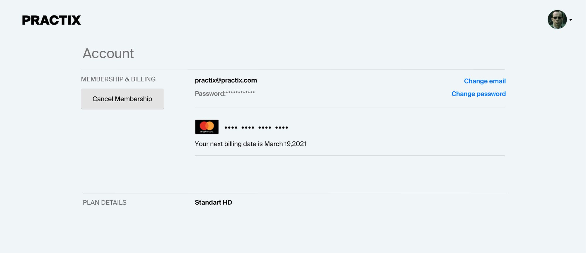
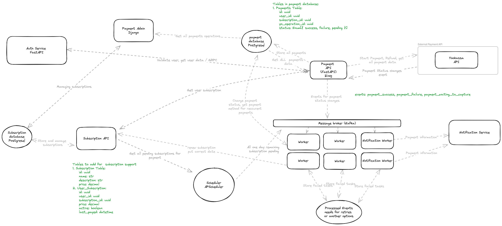

# Проектная работа: диплом.
## Тема диплома: Биллинг
### Постановка задачи:
Выполните проект «Биллинг». Нужно сделать два метода работы с картами: оплатить подписку и вернуть за неё деньги.
При этом система должна быть устойчивой к перебоям: не должно происходить двойных списаний, и чтобы у пользователя
всегда была гарантия, что операция выполнилась. Помимо реализации системы, интегрируйте эту систему с админкой Django,
чтобы вы могли контролировать оплату подписок клиентами. Исходный код проекта лежит [здесь](https://github.com/ProTupfe4/graduate_work)

### Экраны в клиентском приложении

### Выбранный стек технологий
В качестве базового стека технологий было выбрано:

1. [FastAPI](https://fastapi.tiangolo.com) - фреймворк для написания асинхронных API на Python. С его помощью будут написаны Payment API  и  Subscription API
2. [Postgresql](https://www.postgresql.org)  -  СУБД, в которой будут храниться сведения о подписках, история платежей. Используется подход Database Per Service
3. [Redis](https://redis.io) - В ней будут кешироваться часто запрашиваемые ответы на запросы пользователей
4. [Kafka](https://kafka.apache.org) - распределенная платформа потоковой передачи событий. В нее будут складываться события об изменениях статусов оплаты и возврата
5. [Django](https://docs.djangoproject.com/en/5.0/ref/models/fields/) - веб - фреймворк. Она будет служить админкой для платежной системы для получения сведений о платеже
6. [APScheduler](https://apscheduler.readthedocs.io/en/3.x/) - будет выступать в роли асихнронного шедулера для нотификации пользователя о необходимости оплатить
7. В качестве платежной системы выступает [Yoomoney (Yookassa)](https://yoomoney.ru)
c их python [SDK](https://git.yoomoney.ru/projects/SDK/repos/yookassa-sdk-python/browse/README.md)

### Требования к продукту

#### Функциональные требования предъявляемые к программному продукту:
 1. Система должна предоставлять возможность оплачивать подписку за определенный период времени
 2. Система должна предоставлять возможность совершать возврат платежей
 3. Система должна предоставлять возможность просмотра истории платежей и возвратов
 4. Система должна предоставлять возможность просмотра состояния платежей
 5. Система должна предоставлять возможность уведомления пользователей о состоянии платежа
 6. Система должна корректно изменять состояние подписки после проведения платежа
 7. Система должна позволять управлять подписками, добавлять, редактировать
 8. Система должна предоставлять административные функции по работе с пользовательскими подписками с админки
 9. Система должна предоставлять возможность повторить платеж
10. Система должна предоставлять возможности по поддержке возможности осуществлять реккурентные платежи

#### Нефунциональные требования предъявляемые  к программному продукту:
 1. Система должна обеспечивать непротиворечивости данных (обеспечивать идемпотентность)
 2. Система должна быть отказоустойчивой.
 3. Система должна гарантировать обработку операции ровно один раз
 4. Время отклика системы не должно превышать одной секунды
 5. Система должна поддерживать масштабирование для устойчивой работы при увеличении нагрузки
 6. Система должна обеспечивать высокую производительность при обработке запросов 
 7. Система должна быть доступна в течении 99.99% времени в год

###  Архитектура проекта

### Структура проекта

    <pre>
    .
    ├── payment_admin                           # Сервис администрирования подписками и оплатой
    │   ├── app/                                # Исходный код сервиса администрирования на Django
    │   ├── postgres/                           # Необходимые скрипты и сборки контейнеров для базы данных административной панели
    │   ├── Dockerfile            
    ├── elastic                                 # Сервис Elasticsearch. Мы собираем свой образ на базе образа elasticsearch:8.6.2
    │   ├── Dockerfile  
    ├── envs                                    # Папка в которой хранятся примеры env файлов, необходимых для развертывания приложения
    │   ├── .env.api.auth.example               # Пример env файла для сервиса авторизации.
    │   ├── .env.database.*.example             # Пример env файла для postgresql баз данных различных сервисов.
    │   ├── .env.payment.admin.example          # Пример env файла для сервиса администрирования платежей и подписок.
    │   ├── .env.payment.api.example            # Пример env файла для сервиса платежей.
    │   ├── .env.api.subscriptions.example      # Пример env файла для сервиса подписок.
    ├── subscription-api                        # REST сервис подписок.
    │   ├── src/                                # Исходный код сервиса
    │   ├── tests/                              # Unit тесты
    │   ├── docker-entrypoint.sh                # скрипт для запуска контейнера
    │   ├── requirements.txt                    # необходимые зависимости сервиса 
    │   ├── Dockerfile                          # docker файл для сборки контейнера 
    ├── nginx                                   # Reverse Proxy nginx. Мы собираем свой образ на базе nginx:latest docker образа
    │   ├── config/                             # Папка содержащая конфигурационные файлы cервисов nginx 
    │   ├── ssl/                                # Самоподписанные сертификаты ssl 
    │   ├── Dockerfile                          # docker файл для сборки контейнера 
    ├── payment-api                             # REST сервис платежей.
    │   ├── src/                                # Исходный код сервиса
    │   ├── tests/                              # Unit тесты
    │   ├── docker-entrypoint.sh                # скрипт для запуска контейнера
    │   ├── requirements.txt                    # необходимые зависимости сервиса 
    │   ├── Dockerfile                          # docker файл для сборки контейнера 
    ├── auth_service                            # REST сервис авторизации.
    │   ├── src/                                # Исходный код сервиса
    │   ├── tests/                              # Unit тесты
    │   ├── docker-entrypoint.sh                # скрипт для запуска контейнера
    │   ├── requirements.txt                    # необходимые зависимости сервиса 
    │   ├── Dockerfile                          # docker файл для сборки контейнера 
    ├── payment-worker                          # Воркер для обработки входящих событий о платежах
    │   ├── src/                                # Исходный код сервиса
    │   ├── tests/                              # Unit тесты
    │   ├── docker-entrypoint.sh                # скрипт для запуска контейнера
    │   ├── requirements.txt                    # необходимые зависимости сервиса 
    │   ├── Dockerfile                          # docker файл для сборки контейнера 
    ├── subscription-scheduler                       # Шедулер для выполнения периодических задач, например уведомления о том что нужно совершить платеж
    │   ├── src/                                # Исходный код сервиса
    │   ├── tests/                              # Unit тесты
    │   ├── docker-entrypoint.sh                # скрипт для запуска контейнера
    │   ├── requirements.txt                    # необходимые зависимости сервиса 
    │   ├── Dockerfile                          # docker файл для сборки контейнера 
    ├── .flake8
    ├── .pre-commit-config.yaml
    ├── docker-compose-dev.yaml
    ├── Makefile
    └── README.md
    </pre>

### Развертывание системы и эксплуатация
1. Необходимо склонировать репозиторий: <code> git clone git@github.com:ProTupfe4/graduate_work.git </code> 
2. Удалить суффикс *.example* из файлов <code> envs/prod/.env.* </code> и отредактировать переменные окружения при желании
3. Запустить программу с помощью команды <code> make run </code> или  <code> docker compose up -d </code>
При запуске у вас будут активны следующие пути для просмотра **swagger** документации по ip по порту 81(HTTP) или 443 (HTTPS):
- /api/auth/openapi - OpenAPI сервиса авторизации
- /api/subscriptions/openapi - OpenAPI сервиса подписок
- /api/payments/openapi - OpenAPI сервиса платежей
- /payment-admin  - Административная панель Django. Логин/пароль: super/password
4. Остановить программу можно с помощью команды <code> make stop </code> или <code> docker compose down </code>