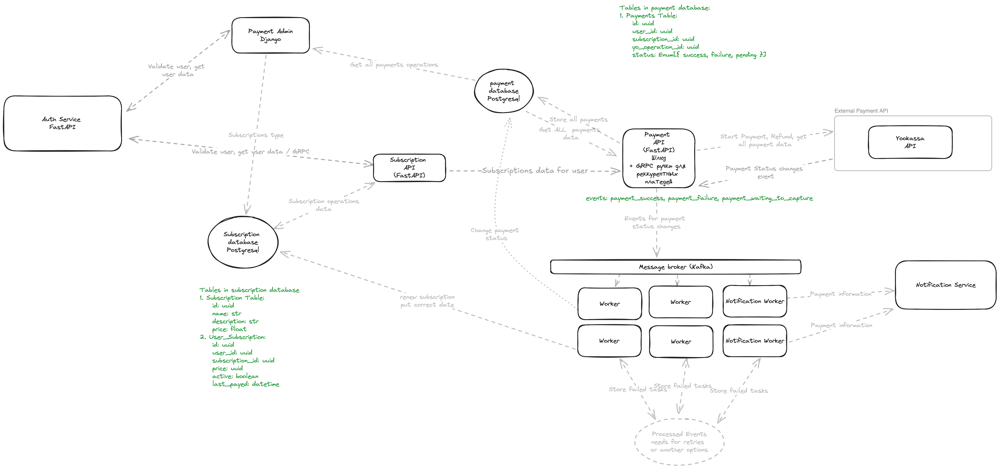

# Проектная работа: диплом.
## Тема диплома: Биллинг
### Постановка задачи:
Выполните проект «Биллинг». Нужно сделать два метода работы с картами: оплатить подписку и вернуть за неё деньги.
При этом система должна быть устойчивой к перебоям: не должно происходить двойных списаний, и чтобы у пользователя
всегда была гарантия, что операция выполнилась. Помимо реализации системы, интегрируйте эту систему с админкой Django,
чтобы вы могли контролировать оплату подписок клиентами.

### Экраны в клиентском приложении

### Выбранный стек технологий
В качестве базового стека технологий было выбрано:

1. [FastAPI](https://fastapi.tiangolo.com) - фреймворк для написания асинхронных API на Python. С его помощью будут написаны Payment API  и  Subscription API
2. [Postgresql](https://www.postgresql.org)  -  СУБД, в которой будут храниться сведения о подписках, история платежей. Используется подход Database Per Service
3. [Redis](https://redis.io) - В ней будут кешироваться часто запрашиваемые ответы на запросы пользователей
4. [Kafka](https://kafka.apache.org) - распределенная платформа потоковой передачи событий. В нее будут складываться события об изменениях статусов оплаты и возврата
5. [Django](https://docs.djangoproject.com/en/5.0/ref/models/fields/) - веб - фреймворк. Она будет служить админкой для платежной системы для получения сведений о платеже
6. [APScheduler](https://apscheduler.readthedocs.io/en/3.x/) - будет выступать в роли асихнронного шедулера для нотификации пользователя о необходимости оплатить
В качестве платежной системы выступает [Yoomoney (Yookassa)](https://yoomoney.ru)
c их python [SDK](https://git.yoomoney.ru/projects/SDK/repos/yookassa-sdk-python/browse/README.md)

###  Архитектура проекта

